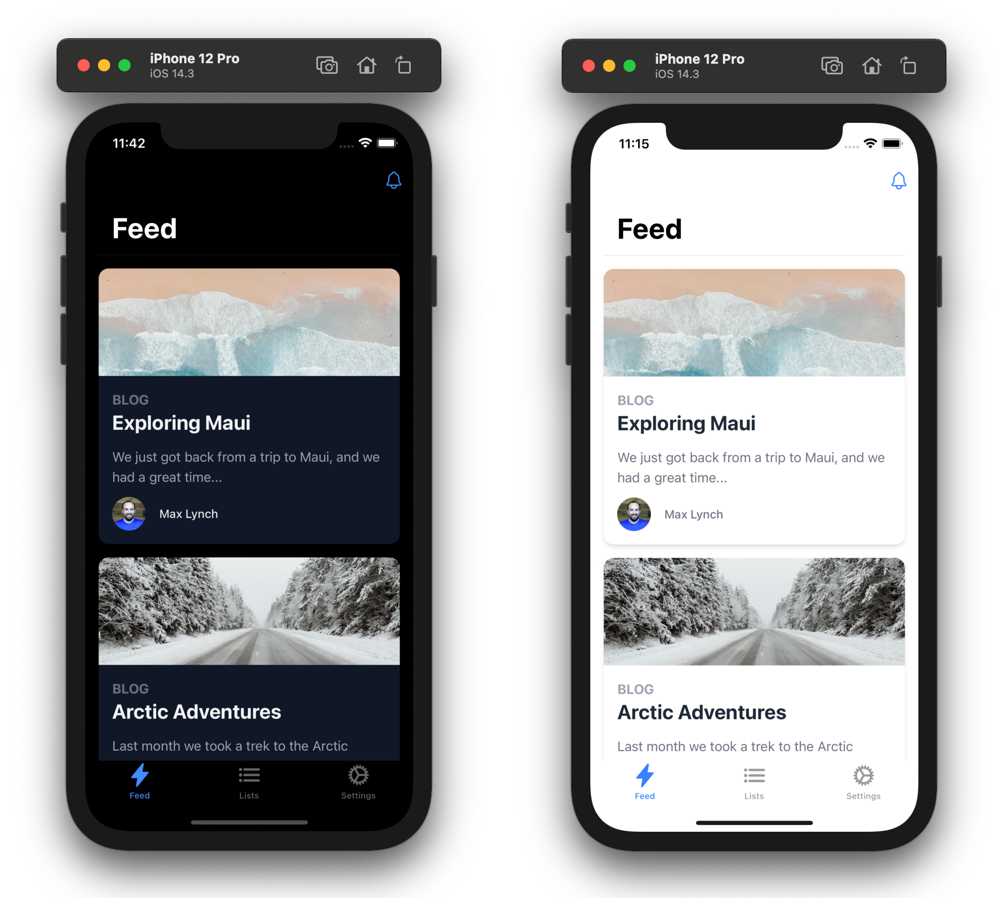
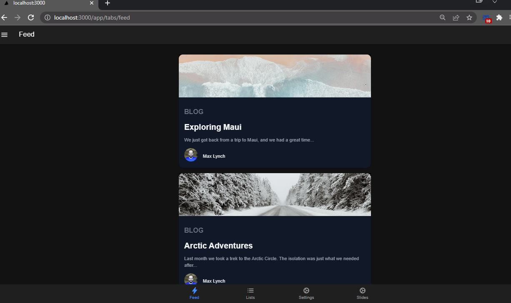

# Next.js + Tailwind CSS + Ionic Framework + Capacitor Mobile Starter

### - Running on Device


### - Running on Browser


### - Running nextjs-web based


This repo is a conceptual starting point for building an iOS, Android, and Progressive Web App with Next.js, Tailwind CSS, [Ionic Framework](https://ionicframework.com/), and [Capacitor](https://capacitorjs.com/).

Next.js handles the production React app experience, Tailwind can be used to style each page of your app, Ionic Framework provides the cross-platform system controls (navigation/transitions/tabs/etc.), and then Capacitor bundles all of it up and runs it on iOS, Android, and Web with full native access.

## Usage

This project is a standard Next.js app, so the typical Next.js development process applies (`npm run dev` for browser-based development). However, there is one caveat: the app must be exported to deploy to iOS and Android, since it must run purely client-side. ([more on Next.js export](https://nextjs.org/docs/advanced-features/static-html-export))

To build the app, run:

```bash
npm run build
npm run export
```

All the client side files will be sent to the `./out/` directory. These files need to be copied to the native iOS and Android projects, and this is where Capacitor comes in:

```bash
npx cap sync
```

Finally, to run the app, use Capacitor 3 new awesome run command:

```
npx cap run ios
npx cap open android
```

## Livereload/Instant Refresh

To enable Livereload and Instant Refresh during development (when running `npm run dev`), find the IP address of your local interface (ex: `192.168.1.2`) and port your Next.js server is running on, and then set the server url config value to point to it in `capacitor.config.json`:

```json
{
  "server": {
    "url": "http://192.168.1.2:3000"
  }
}
```